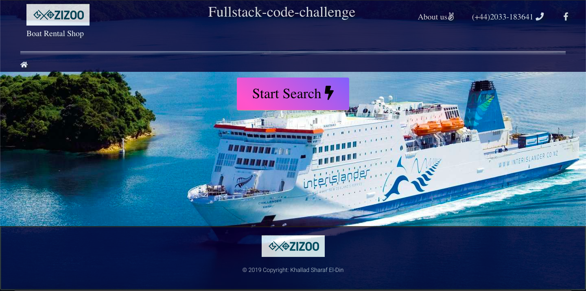
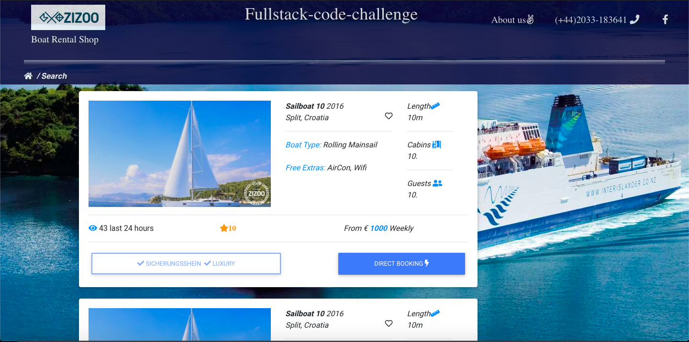

# Deployed on Heroku
### https://react-v16.herokuapp.com/Search

## Available Scripts

In the project directory, you can run:

### `npm install`
install dependencies from package.json to build the application 

### `npm start`

Runs the app in the development mode. 
Open [http://localhost:3000](http://localhost:3000) to view it in the browser.

The page will reload if you make edits. 
You will also see any lint errors in the console.

### `npm test`

Launches the test runner in the interactive watch mode. 
See the section about [running tests](https://facebook.github.io/create-react-app/docs/running-tests) for more information.

### `npm run build`

Builds the app for production to the `build` folder. 
It correctly bundles React in production mode and optimizes the build for the best performance.

The build is minified and the filenames include the hashes. 
Your app is ready to be deployed!

### Task

Create simple react component for a search listing card based located in this repo.
Request search results from a GraphQL API for all boats between 10m and 20m in length with newer than 2010.
Render the results using the API response and the react component.
Duration: 4 - 5 hours

## Additional 
According to time there is a lot of features need to be completed or fixed  
Unit testing and Responsive design not applied because of time 
i am not experienced with GraphQl actually first time to write a Graphql Query
